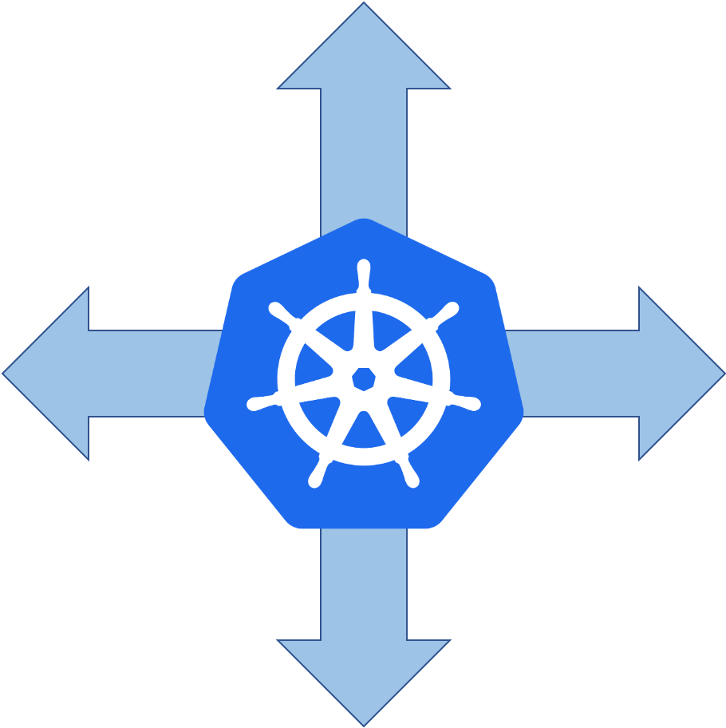

# autoscaling-operator
<p align="center">

</p>

<p align="center">
<a href="https://github.com/ankitcharolia/autoscaling-operator/actions/workflows/ci.yml"></a>
<a href="https://github.com/ankitcharolia/autoscaling-operator/actions/workflows/release.yml"></a>
<a href="https://github.com/ankitcharolia/autoscaling-operator/actions/workflows/helm.yml"></a>
<a href="https://github.com/ankitcharolia/autoscaling-operator/actions/workflows/manifests.yml"></a>
<a href="https://github.com/ankitcharolia/autoscaling-operator/actions/workflows/olm-helm.yml"></a>
</p>

<p align="center">
<a href="https://goreportcard.com/report/github.com/autoscaling-operator/autoscaling-operator"></a>
<a href="https://pkg.go.dev/github.com/autoscaling-operator/autoscaling-operator"></a>
<a href="https://artifacthub.io/packages/helm/autoscaling-operator/autoscaling-operator"></a>
<a href="https://operatorhub.io/operator/autoscaling-operator"></a>
</p>

## Description
// TODO(user): An in-depth paragraph about your project and overview of use


**Create instances of your solution**
You can apply the samples (examples) from the config/sample:

```sh
kubectl apply -k config/samples/
```

## Contributing
// TODO(user): Add detailed information on how you would like others to contribute to this project
